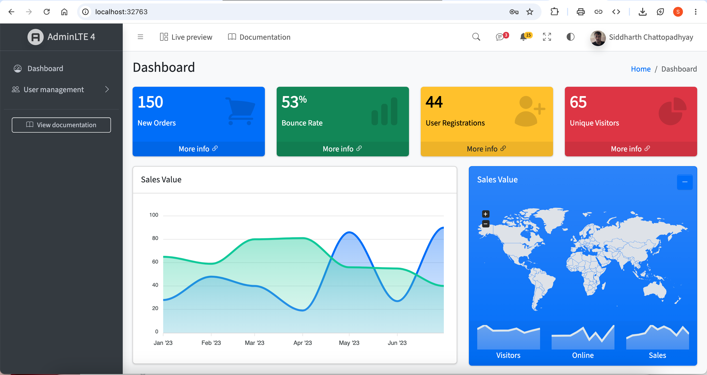
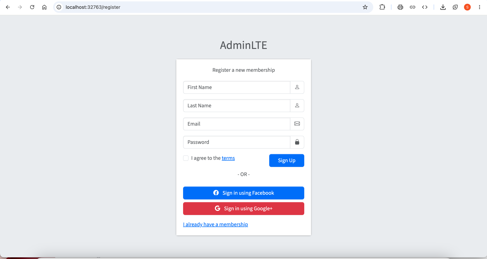
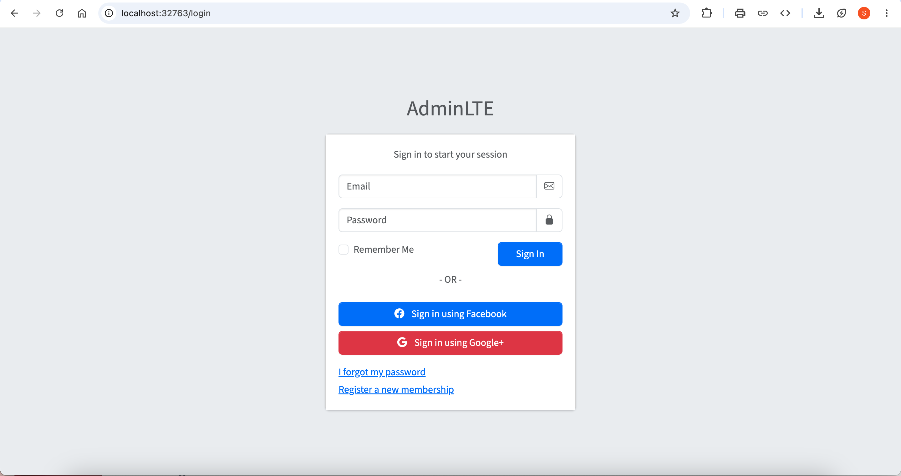

# Admin User Management 

## 🔹 Project Description

This is an Admin Panel that allows you to manage User Account using Web UI. It is build on top of Express.js and MongoDB. It uses cookies to
store user ID which is then being used to handle user login session. This cookie is stored for 24 hours after each login. You can also register your account for yourself or add new account if you already have admin access. This HTML/CSS/JS project was converted to EJS/NODE.JS.

---

## 🔹 What is included in this project

- Admin Account Registration
- Login Page
- CRUD
- Profile Management
- Multer integration (profile picture)
- MongoDB integration
- Mobile Friendly
- Route Protection (login)

---

## 🔹 How This Project is Made

- **Express and EJS** was used as a backend and webpage.
- **MongoDB** was used for database storage.
- **Multer** was used for image storing, while MongoDB stores the image path.
- **Nodemon** used during development (auto restarts).
- **Cookies** were used for storing serialized user.

--- 

## 🔹 Technology Used
- EJS
- NodeJS
- Nodemon
- MongoDB
- Express JS
- Multer

---

## 🔹 Project Explaination Video

---

## 🔹 Project Screenshots

### Project Screen Recording
[Screen Recording (inner view only)](https://youtu.be/OtZ2FXyQwrQ)

### Dashboard

### Register

### Login
